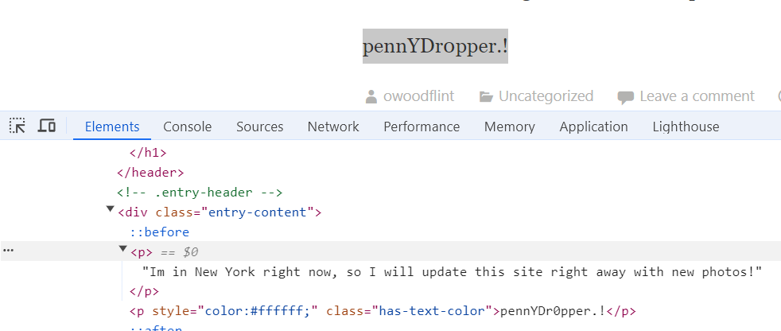
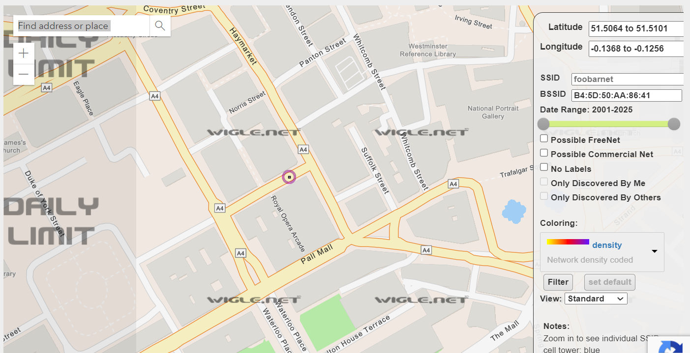

# OSINT CHALLENGE
## TRYHACKME CTF ROOM
*https://tryhackme.com/r/room/ohsint*

### Description
What information can you possible get with just one image file?
- Download the image and find hidden clues to follow the trail

### Walkthrough
- Open Kali Linux machine, navigate to THM and download the image file.

- We will need to use the exiftool tool to reveal some metadata. Open a terminal and use the command **exiftool /home/kali/Downloads/windows.jpg**

- The returned results in the terminal are very useful. We can the image is copyrighted to *OWoodflint*.

- This is our first clue, we now need to use some online searching techniques to find some more information about OWoodflint. 

- By doing a search of the name, we are returned 2 web links that are directly linked...

**Twitter**
The first link i came across is a twitter account registed to @OWoodflint. The avatar is a cat (this answers our first flag)

  #### Interesting things
  - bSSID: B4:5D:50:AA:86:41

**Github**
The next is a repo registed to a github user @OWoodfl1nt called 'people_finder'. (flag 5)

   #### Interesting things
   - They are located in london (this answers our second flag)
   - Their twitter account is confirmed to be the account we already found
   -  We have their email 'OWoodflint@gmail.com' (flag 4)
   - Link to their Wordpress 

- This information will hopefully click together with the more we search. Lets look at the wordpress link. 'https://oliverwoodflint.wordpress.com/author/owoodflint/'
      - So we can see they're out of town and are currently working on a project. (flag 6)
      - Lets inspect the webpage.

- It seems Oliver has not stored their password safely! (flag 7)

- Lets use the online tool https://wigle.net/ to see if a wardriver has also spotted this access point. 
      - Sure enough, we get a match!

